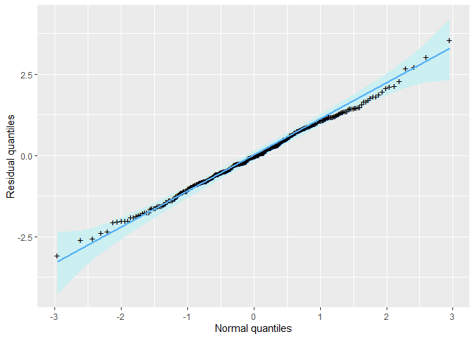

<!-- README.md is generated from README.Rmd. Please edit that file -->

# `bcsnsm`: Multivariate regression analysis of positive data based on the BCS-NSM distributions

<!-- badges: start -->

[](https://github.com/rdmatheus/bcsnsm/actions/workflows/R-CMD-check.yaml)
<!-- badges: end -->

The `bcsnsm` package is dedicated to the estimation and analysis of
goodness-of-fit within the class of the multivariate BCS-NSM regression
models. The package includes implementations of some Box-Cox symmetric
and log-symmetric distributions for marginal modeling. It provides the
Gaussian, $t$, slash, and hyperbolic copulas with some options of
association matrices for dependence modeling.

## Installation

The development version of the `bcsnsm` package is hosted on
[GitHub](https://github.com/rdmatheus/bcsnsm). The installation of the
package can be done using the `devtools` package. If it has not been
previously installed, it can be added by executing the following command
in the `R` environment: `install.packages("devtools")`.

After installing the `devtools` package, if you are using *Windows*, it
may be necessary to install the current version of the `RTools` program,
available for download [at
here](https://cran.r-project.org/bin/windows/Rtools). Finally, the
development version of the `bcsnsm` can be installed by executing the
following command:

``` r
devtools::install_github("rdmatheus/bcsnsm")
```

## Example

The `bcsnsm` package provides functions for estimation and inference for
the parameters as well diagnostic tools for assessing the
goodness-of-fit of the model. Below is an example of some functions
usage and available methods.

``` r
## Loading packages
library(bcsnsm)
```

### `macronutrients` dataset

The `macronutrients` dataset is a subset of a study conducted by
Ferreira et al. (2014) on the nutrient intake patterns of older adults
in Botucatu, São Paulo, Brazil. The description of the available
variables can be accessed in the data documentation by running the
following command: `?macronutrients`.

The dependent variables consist of the macronutrient intake based on the
first 24-h dietary recall interview, where each sampling unit provides a
vector with dimension 6 with the intake of animal protein (*g*), plant
protein (*g*), fiber (*g*), carbohydrate (*g*), total fat (*g*), and
cholesterol (*mg*). The dataset also provides socioeconomic variables.

``` r
str(macronutrients)
#> Classes 'tbl_df', 'tbl' and 'data.frame':    322 obs. of  11 variables:
#>  $ animal_p   : num  53.2 70.2 192.5 36 44.7 ...
#>  $ plant_p    : num  25.1 19.1 46.4 34.8 37.6 ...
#>  $ fiber      : num  12.3 13.2 24.3 26.1 18.5 ...
#>  $ carb       : num  189 117 518 148 163 ...
#>  $ total_fat  : num  84.5 48.3 311.6 39.2 76.4 ...
#>  $ cholesterol: num  250 175 1257 277 133 ...
#>  $ gender     : Factor w/ 2 levels "Female","Male": 1 1 2 1 1 1 2 1 2 1 ...
#>  $ age        : num  71 67 61 62 65 64 64 62 69 76 ...
#>  $ education  : Factor w/ 2 levels "illiterate_elementary",..: 1 1 2 2 1 1 2 2 1 1 ...
#>  $ income     : Factor w/ 4 levels "I","II","III",..: 1 3 4 4 1 1 2 3 1 1 ...
#>  $ npeople    : num  4 4 3 3 1 4 4 4 2 1 ...
#>  - attr(*, "na.action")= 'omit' Named int [1:43] 10 37 70 84 89 90 117 119 129 135 ...
#>   ..- attr(*, "names")= chr [1:43] "10" "37" "70" "84" ...
```

The `bcsnsm` package provides the `mvplot()` function for visualizing
multivariate data. See the documentation by running `?mvplot`

``` r
mvplot(macronutrients[, 1:6], method = "kendall")
```


### Regression modeling

The main function of the package is `bcsnsmreg()`, which performs
maximum likelihood estimation for BCS-NSM regression models. For
details, see the documentation with `?bcsnsmreg`.

This function allows users to specify different Box-Cox symmetric
marginal distributions, association structures, and copulas. Currently,
the package supports Gaussian, $t$, slash, and hyperbolic copulas. The
available Box-Cox symmetric distributions and log-symmetric special
cases in the package are listed below.

| Distribution              | Abbreviation | Distribution          | Abbreviation |
|:--------------------------|:-------------|:----------------------|:-------------|
| Box-Cox Cauchy            | “bcca”       | Log-Cauchy            | “lca”        |
| Box-Cox Hyperbolic        | “bchp”       | Log-Hyperbolic        | “lhp”        |
| Box-Cox Laplace           | “bcla”       | Log-Laplace           | “lla”        |
| Box-Cox Type I Logistic   | “bcloi”      | Log-Type I Logistic   | “lloi”       |
| Box-Cox Type II Logistic  | “bcloii”     | Log-Type II Logistic  | “lloii”      |
| Box-Cox Normal            | “bcno”       | Log-Normal            | “lno”        |
| Box-Cox Power exponential | “bcpe”       | Log-Power exponential | “lpe”        |
| Box-Cox Slash             | “bcsl”       | Log-Slash             | “lsl”        |
| Box-Cox t                 | “bct”        | Log-t                 | “lt”         |

The class of the BCS-NSM regression models provides flexibility in
specifying both marginal distributions and dependence structures.
Therefore, applying the model in practice requires selecting several
components. We suggest the following steps:

1.  Choose the marginal distributions while maintaining the Gaussian
    copula and regression structure;
2.  Given the selected marginal distributions, specify a copula;
3.  Based on the chosen marginal distributions and copula, refine the
    model by removing non-significant explanatory variables. We will
    illustrate the use of the `bcsnsmreg()` function by fitting a
    BCS-NSM regression to the `macronutrient` dataset.

#### Step 1:

We begin by fitting a six-variate BCS-NSM regression model to the vector
of dependent variables: animal protein, plant protein, fiber,
carbohydrate, total fat, and cholesterol. These variables are modeled as
functions of gender, age, education level, number of people in the
household, and income. The reference model assumes “bcno” distributions
for all marginals and a Gaussian copula. These are the default
specifications of the `bcsnsmreg()` function. Below, we present the
summary of the fit and the normal probability plots of the marginal
quantile residuals.

``` r
## Reference model
fit0 <- bcsnsmreg(animal_p + plant_p + fiber + carb + total_fat + cholesterol ~
                  gender + age + education + npeople + income, data = macronutrients)

# Summary
summary(fit0)
#> 
#> Multivariate BCS-NSM Regression with Gaussian Copula
#> 
#> 
#> Call:
#> 
#> bcsnsmreg(formula = animal_p + plant_p + fiber + carb + total_fat + 
#>     cholesterol ~ gender + age + education + npeople + income, 
#>     data = macronutrients)
#> 
#> 
#> Quantile residuals:
#> 
#>      Mean Std. dev. Skewness Kurtosis
#>   -0.1544     1.292   0.7136    4.644
#> 
#> animal_p ~ Box-Cox Normal Distribution:
#> 
#> Regression coefficients with log link function:
#>                              Est Std. Error z value Pr(>|z|)    
#> (Intercept)               3.7031     0.3443  10.754   <2e-16 ***
#> genderMale                0.2268     0.0670   3.386   0.0007 ***
#> age                      -0.0002     0.0045  -0.046   0.9634    
#> educationhigh_university -0.0220     0.0944  -0.233   0.8155    
#> npeople                   0.0145     0.0197   0.736   0.4620    
#> incomeII                  0.1400     0.1069   1.310   0.1901    
#> incomeIII                 0.0845     0.1433   0.590   0.5553    
#> incomeIV                  0.1237     0.1667   0.743   0.4578    
#> ---
#> Signif. codes:  0 '***' 0.001 '**' 0.01 '*' 0.05 '.' 0.1 ' ' 1
#> 
#> Further marginal parameters:
#>           Est Std. Error
#> sigma  0.6221     0.0266
#> lambda 0.4137     0.0566
#> 
#> plant_p ~ Box-Cox Normal Distribution:
#> 
#> Regression coefficients with log link function:
#>                              Est Std. Error z value Pr(>|z|)    
#> (Intercept)               3.0163     0.2936  10.272   <2e-16 ***
#> genderMale                0.2418     0.0523   4.627   <2e-16 ***
#> age                       0.0035     0.0039   0.901    0.367    
#> educationhigh_university  0.0075     0.0767   0.097    0.922    
#> npeople                   0.0010     0.0160   0.061    0.952    
#> incomeII                 -0.0736     0.0844  -0.871    0.384    
#> incomeIII                -0.0013     0.1139  -0.012    0.991    
#> incomeIV                 -0.1103     0.1313  -0.840    0.401    
#> ---
#> Signif. codes:  0 '***' 0.001 '**' 0.01 '*' 0.05 '.' 0.1 ' ' 1
#> 
#> Further marginal parameters:
#>           Est Std. Error
#> sigma  0.4694     0.0199
#> lambda 0.4085     0.0680
#> 
#> fiber ~ Box-Cox Normal Distribution:
#> 
#> Regression coefficients with log link function:
#>                              Est Std. Error z value Pr(>|z|)    
#> (Intercept)               2.5140     0.3343   7.519   <2e-16 ***
#> genderMale                0.1743     0.0591   2.948   0.0032 ** 
#> age                       0.0034     0.0044   0.780   0.4353    
#> educationhigh_university  0.1442     0.0864   1.668   0.0953 .  
#> npeople                  -0.0041     0.0178  -0.230   0.8177    
#> incomeII                 -0.0673     0.0946  -0.711   0.4772    
#> incomeIII                 0.0437     0.1286   0.340   0.7337    
#> incomeIV                 -0.1277     0.1492  -0.856   0.3923    
#> ---
#> Signif. codes:  0 '***' 0.001 '**' 0.01 '*' 0.05 '.' 0.1 ' ' 1
#> 
#> Further marginal parameters:
#>           Est Std. Error
#> sigma  0.5214     0.0220
#> lambda 0.3177     0.0641
#> 
#> carb ~ Box-Cox Normal Distribution:
#> 
#> Regression coefficients with log link function:
#>                              Est Std. Error z value Pr(>|z|)    
#> (Intercept)               4.7796     0.2586  18.484   <2e-16 ***
#> genderMale                0.1275     0.0477   2.674   0.0075 ** 
#> age                       0.0078     0.0034   2.297   0.0216 *  
#> educationhigh_university  0.0436     0.0688   0.634   0.5258    
#> npeople                  -0.0131     0.0142  -0.928   0.3532    
#> incomeII                 -0.0379     0.0763  -0.497   0.6191    
#> incomeIII                -0.0227     0.1048  -0.217   0.8284    
#> incomeIV                  0.0034     0.1187   0.029   0.9769    
#> ---
#> Signif. codes:  0 '***' 0.001 '**' 0.01 '*' 0.05 '.' 0.1 ' ' 1
#> 
#> Further marginal parameters:
#>           Est Std. Error
#> sigma  0.4217     0.0176
#> lambda 0.2307     0.0801
#> 
#> total_fat ~ Box-Cox Normal Distribution:
#> 
#> Regression coefficients with log link function:
#>                              Est Std. Error z value Pr(>|z|)    
#> (Intercept)               4.1702     0.3055  13.651   <2e-16 ***
#> genderMale                0.2070     0.0585   3.540   0.0004 ***
#> age                      -0.0024     0.0040  -0.594   0.5524    
#> educationhigh_university  0.0404     0.0855   0.472   0.6368    
#> npeople                  -0.0028     0.0174  -0.162   0.8712    
#> incomeII                  0.0122     0.0952   0.128   0.8981    
#> incomeIII                -0.0227     0.1292  -0.176   0.8604    
#> incomeIV                 -0.0654     0.1464  -0.446   0.6553    
#> ---
#> Signif. codes:  0 '***' 0.001 '**' 0.01 '*' 0.05 '.' 0.1 ' ' 1
#> 
#> Further marginal parameters:
#>           Est Std. Error
#> sigma  0.5223     0.0211
#> lambda 0.0232     0.0764
#> 
#> cholesterol ~ Box-Cox Normal Distribution:
#> 
#> Regression coefficients with log link function:
#>                             Est Std. Error z value Pr(>|z|)    
#> (Intercept)              4.8861     0.4163  11.738   <2e-16 ***
#> genderMale               0.1419     0.0825   1.720   0.0854 .  
#> age                      0.0042     0.0054   0.784   0.4330    
#> educationhigh_university 0.1325     0.1203   1.101   0.2707    
#> npeople                  0.0091     0.0243   0.376   0.7073    
#> incomeII                 0.1172     0.1320   0.887   0.3749    
#> incomeIII                0.0375     0.1815   0.206   0.8364    
#> incomeIV                 0.0249     0.2072   0.120   0.9043    
#> ---
#> Signif. codes:  0 '***' 0.001 '**' 0.01 '*' 0.05 '.' 0.1 ' ' 1
#> 
#> Further marginal parameters:
#>           Est Std. Error
#> sigma  0.7601     0.0317
#> lambda 0.2970     0.0411
#> 
#> Unstructured association matrix:
#> 
#>             animal_p plant_p   fiber   carb total_fat cholesterol
#> animal_p           .       .       .      .         .           .
#> plant_p       0.1460       .       .      .         .           .
#> fiber         0.0471  0.7804       .      .         .           .
#> carb          0.2422  0.7306  0.6619      .         .           .
#> total_fat     0.5998  0.4787  0.3293 0.5572         .           .
#> cholesterol   0.6458  0.1353 -0.0059 0.2913    0.5985           .
#> 
#> --- 
#> logLik: -8908.079 | AIC: 17966.16 | BIC: 18249.25

# Normal probability plot
plot(fit0, "marginal", panel = c(2, 3))
```


The normal probability plots suggest that the marginal distributions for
the intake of animal protein, plant protein, fiber, and cholesterol have
heavier tails than those of “bcno”. Based on the AIC, BIC, and residual
analysis, we chose the following marginal distributions: “bcloii”,
“bcloii”, “bct”, “bcno”, “bcno”, “bcloii”.

``` r
## Improved model
fit_gauss <- bcsnsmreg(animal_p + plant_p + fiber + carb + total_fat + cholesterol ~
                  gender + age + education + npeople + income, data = macronutrients,
                  margins = c("bcloii", "bcloii", "bct", "bcno", "bcno", "bcloii"))

# Summary
summary(fit_gauss)
#> 
#> Multivariate BCS-NSM Regression with Gaussian Copula
#> 
#> 
#> Call:
#> 
#> bcsnsmreg(formula = animal_p + plant_p + fiber + carb + total_fat + 
#>     cholesterol ~ gender + age + education + npeople + income, 
#>     data = macronutrients, margins = c("bcloii", "bcloii", 
#>         "bct", "bcno", "bcno", "bcloii"))
#> 
#> 
#> Quantile residuals:
#> 
#>       Mean Std. dev. Skewness Kurtosis
#>   -0.09786     1.217     0.65    4.632
#> 
#> animal_p ~ Box-Cox Type II Logistic Distribution:
#> 
#> Regression coefficients with log link function:
#>                             Est Std. Error z value Pr(>|z|)    
#> (Intercept)              3.4878     0.3523   9.899   <2e-16 ***
#> genderMale               0.2354     0.0660   3.568   0.0004 ***
#> age                      0.0022     0.0046   0.472   0.6371    
#> educationhigh_university 0.0449     0.0918   0.490   0.6244    
#> npeople                  0.0242     0.0216   1.122   0.2620    
#> incomeII                 0.0938     0.1027   0.914   0.3608    
#> incomeIII                0.0428     0.1543   0.278   0.7814    
#> incomeIV                 0.0456     0.1586   0.288   0.7737    
#> ---
#> Signif. codes:  0 '***' 0.001 '**' 0.01 '*' 0.05 '.' 0.1 ' ' 1
#> 
#> Further marginal parameters:
#>           Est Std. Error
#> sigma  0.3486     0.0172
#> lambda 0.4082     0.0899
#> 
#> plant_p ~ Box-Cox Type II Logistic Distribution:
#> 
#> Regression coefficients with log link function:
#>                              Est Std. Error z value Pr(>|z|)    
#> (Intercept)               2.8528     0.2957   9.647   <2e-16 ***
#> genderMale                0.2484     0.0513   4.845   <2e-16 ***
#> age                       0.0054     0.0039   1.388    0.165    
#> educationhigh_university  0.0749     0.0736   1.018    0.309    
#> npeople                   0.0015     0.0165   0.092    0.927    
#> incomeII                 -0.1204     0.0844  -1.427    0.154    
#> incomeIII                 0.0112     0.1076   0.104    0.917    
#> incomeIV                 -0.1199     0.1202  -0.997    0.319    
#> ---
#> Signif. codes:  0 '***' 0.001 '**' 0.01 '*' 0.05 '.' 0.1 ' ' 1
#> 
#> Further marginal parameters:
#>           Est Std. Error
#> sigma  0.2632     0.0125
#> lambda 0.3213     0.0906
#> 
#> fiber ~ Box-Cox t Distribution:
#> 
#> Regression coefficients with log link function:
#>                              Est Std. Error z value Pr(>|z|)    
#> (Intercept)               2.3097     0.3295   7.009   <2e-16 ***
#> genderMale                0.1727     0.0576   2.996   0.0027 ** 
#> age                       0.0060     0.0043   1.384   0.1663    
#> educationhigh_university  0.2156     0.0830   2.597   0.0094 ** 
#> npeople                  -0.0059     0.0181  -0.324   0.7459    
#> incomeII                 -0.0801     0.0919  -0.872   0.3835    
#> incomeIII                 0.0469     0.1235   0.380   0.7042    
#> incomeIV                 -0.1544     0.1426  -1.082   0.2790    
#> ---
#> Signif. codes:  0 '***' 0.001 '**' 0.01 '*' 0.05 '.' 0.1 ' ' 1
#> 
#> Further marginal parameters:
#>            Est Std. Error
#> sigma   0.4708     0.0267
#> lambda  0.2589     0.0860
#> nu     10.7177     4.4988
#> 
#> carb ~ Box-Cox Normal Distribution:
#> 
#> Regression coefficients with log link function:
#>                              Est Std. Error z value Pr(>|z|)    
#> (Intercept)               4.5118     0.2585  17.452   <2e-16 ***
#> genderMale                0.1347     0.0471   2.862   0.0042 ** 
#> age                       0.0110     0.0034   3.250   0.0012 ** 
#> educationhigh_university  0.0966     0.0679   1.421   0.1553    
#> npeople                  -0.0063     0.0142  -0.446   0.6553    
#> incomeII                 -0.0711     0.0766  -0.928   0.3533    
#> incomeIII                -0.0190     0.1030  -0.184   0.8537    
#> incomeIV                 -0.0299     0.1147  -0.261   0.7943    
#> ---
#> Signif. codes:  0 '***' 0.001 '**' 0.01 '*' 0.05 '.' 0.1 ' ' 1
#> 
#> Further marginal parameters:
#>           Est Std. Error
#> sigma  0.4200     0.0169
#> lambda 0.2037     0.0770
#> 
#> total_fat ~ Box-Cox Normal Distribution:
#> 
#> Regression coefficients with log link function:
#>                              Est Std. Error z value Pr(>|z|)    
#> (Intercept)               3.9332     0.3049  12.901   <2e-16 ***
#> genderMale                0.2173     0.0573   3.789   0.0002 ***
#> age                       0.0005     0.0040   0.133   0.8940    
#> educationhigh_university  0.1005     0.0831   1.209   0.2266    
#> npeople                   0.0005     0.0174   0.030   0.9757    
#> incomeII                 -0.0382     0.0942  -0.405   0.6852    
#> incomeIII                -0.0257     0.1278  -0.201   0.8406    
#> incomeIV                 -0.1193     0.1404  -0.850   0.3956    
#> ---
#> Signif. codes:  0 '***' 0.001 '**' 0.01 '*' 0.05 '.' 0.1 ' ' 1
#> 
#> Further marginal parameters:
#>           Est Std. Error
#> sigma  0.5150     0.0202
#> lambda 0.0103     0.0748
#> 
#> cholesterol ~ Box-Cox Type II Logistic Distribution:
#> 
#> Regression coefficients with log link function:
#>                              Est Std. Error z value Pr(>|z|)    
#> (Intercept)               4.4584     0.4293  10.384   <2e-16 ***
#> genderMale                0.1694     0.0810   2.093   0.0364 *  
#> age                       0.0091     0.0056   1.619   0.1054    
#> educationhigh_university  0.1923     0.1154   1.666   0.0957 .  
#> npeople                   0.0221     0.0238   0.930   0.3526    
#> incomeII                  0.0342     0.1298   0.263   0.7923    
#> incomeIII                 0.0448     0.1804   0.248   0.8041    
#> incomeIV                 -0.0688     0.1959  -0.351   0.7256    
#> ---
#> Signif. codes:  0 '***' 0.001 '**' 0.01 '*' 0.05 '.' 0.1 ' ' 1
#> 
#> Further marginal parameters:
#>           Est Std. Error
#> sigma  0.4253     0.0203
#> lambda 0.2442     0.0571
#> 
#> Unstructured association matrix:
#> 
#>             animal_p plant_p   fiber   carb total_fat cholesterol
#> animal_p           .       .       .      .         .           .
#> plant_p       0.1420       .       .      .         .           .
#> fiber         0.0490  0.7827       .      .         .           .
#> carb          0.2239  0.7349  0.6725      .         .           .
#> total_fat     0.6036  0.4896  0.3186 0.5552         .           .
#> cholesterol   0.6394  0.1314 -0.0148 0.2887    0.5877           .
#> 
#> --- 
#> logLik: -8890.263 | AIC: 17932.53 | BIC: 18219.39

# Normal probability plot
plot(fit_gauss, "marginal", panel = c(2, 3))
```


#### Step 2: Choice of copula

The copula can be specified in the `bcsnsmreg()` function using the
`copula` argument (character). The available options are: Gaussian
(`copula = "gaussian"`), Student’s $t$ (`copula = "t"`), slash
(`copula = "slash"`), and hyperbolic (`copula = "hyp"`).

All copulas except the Gaussian have an additional parameter, $\eta$,
which must be set via the `eta` argument and takes values in the range
$(0,1)$. To assist in choosing this parameter, the `bcsnsm` package
provides the `choose_copula()` function, which selects $\eta$ based on
the highest profiled likelihood over a grid of values. Due to its
computational intensity, we do not reproduce this step in this document.
See `?choose_copula()`.

For our analysis, we selected the Student’s $t$ copula with
$\eta = 0.9$.

``` r
## Fit with t copula
fit_t <- bcsnsmreg(animal_p + plant_p + fiber + carb + total_fat + cholesterol ~
                  gender + age + education + npeople + income, data = macronutrients,
                  margins = c("bcloii", "bcloii", "bct", "bcno", "bcno", "bcloii"),
                  copula = "t", eta = 0.9)

# Summary
summary(fit_t)
#> 
#> Multivariate BCS-NSM Regression with T(0.9) Copula
#> 
#> 
#> Call:
#> 
#> bcsnsmreg(formula = animal_p + plant_p + fiber + carb + total_fat + 
#>     cholesterol ~ gender + age + education + npeople + income, 
#>     data = macronutrients, margins = c("bcloii", "bcloii", 
#>         "bct", "bcno", "bcno", "bcloii"), copula = "t", eta = 0.9)
#> 
#> 
#> Quantile residuals:
#> 
#>      Mean Std. dev. Skewness Kurtosis
#>   -0.0144     1.069   0.1011    2.937
#> 
#> animal_p ~ Box-Cox Type II Logistic Distribution:
#> 
#> Regression coefficients with log link function:
#>                              Est Std. Error z value Pr(>|z|)    
#> (Intercept)               3.4264     0.3547   9.661   <2e-16 ***
#> genderMale                0.2439     0.0656   3.718   0.0002 ***
#> age                       0.0031     0.0046   0.670   0.5026    
#> educationhigh_university  0.0777     0.0912   0.852   0.3942    
#> npeople                   0.0309     0.0213   1.445   0.1484    
#> incomeII                  0.0726     0.1021   0.711   0.4770    
#> incomeIII                -0.0325     0.1466  -0.222   0.8244    
#> incomeIV                  0.0152     0.1596   0.096   0.9239    
#> ---
#> Signif. codes:  0 '***' 0.001 '**' 0.01 '*' 0.05 '.' 0.1 ' ' 1
#> 
#> Further marginal parameters:
#>           Est Std. Error
#> sigma  0.3484     0.0166
#> lambda 0.3092     0.0692
#> 
#> plant_p ~ Box-Cox Type II Logistic Distribution:
#> 
#> Regression coefficients with log link function:
#>                              Est Std. Error z value Pr(>|z|)    
#> (Intercept)               2.5602     0.2981   8.590   <2e-16 ***
#> genderMale                0.2746     0.0510   5.381   <2e-16 ***
#> age                       0.0087     0.0039   2.225   0.0261 *  
#> educationhigh_university  0.0925     0.0719   1.287   0.1981    
#> npeople                   0.0206     0.0164   1.256   0.2090    
#> incomeII                 -0.0993     0.0811  -1.225   0.2207    
#> incomeIII                -0.0160     0.1062  -0.151   0.8801    
#> incomeIV                 -0.1303     0.1204  -1.082   0.2794    
#> ---
#> Signif. codes:  0 '***' 0.001 '**' 0.01 '*' 0.05 '.' 0.1 ' ' 1
#> 
#> Further marginal parameters:
#>           Est Std. Error
#> sigma  0.2655     0.0125
#> lambda 0.2965     0.0854
#> 
#> fiber ~ Box-Cox t Distribution:
#> 
#> Regression coefficients with log link function:
#>                              Est Std. Error z value Pr(>|z|)    
#> (Intercept)               1.9424     0.3356   5.788   <2e-16 ***
#> genderMale                0.2007     0.0575   3.492   0.0005 ***
#> age                       0.0101     0.0044   2.307   0.0211 *  
#> educationhigh_university  0.2200     0.0815   2.697   0.0070 ** 
#> npeople                   0.0165     0.0182   0.906   0.3648    
#> incomeII                 -0.0701     0.0898  -0.780   0.4351    
#> incomeIII                 0.0446     0.1202   0.371   0.7104    
#> incomeIV                 -0.1601     0.1431  -1.119   0.2632    
#> ---
#> Signif. codes:  0 '***' 0.001 '**' 0.01 '*' 0.05 '.' 0.1 ' ' 1
#> 
#> Further marginal parameters:
#>           Est Std. Error
#> sigma  0.4696     0.0287
#> lambda 0.2720     0.0846
#> nu     8.6421     3.3091
#> 
#> carb ~ Box-Cox Normal Distribution:
#> 
#> Regression coefficients with log link function:
#>                              Est Std. Error z value Pr(>|z|)    
#> (Intercept)               4.2077     0.2603  16.166   <2e-16 ***
#> genderMale                0.1448     0.0464   3.120   0.0018 ** 
#> age                       0.0146     0.0034   4.303   <2e-16 ***
#> educationhigh_university  0.1114     0.0657   1.697   0.0898 .  
#> npeople                   0.0106     0.0138   0.770   0.4415    
#> incomeII                 -0.0775     0.0747  -1.037   0.2998    
#> incomeIII                -0.0518     0.1003  -0.516   0.6058    
#> incomeIV                 -0.0126     0.1101  -0.115   0.9086    
#> ---
#> Signif. codes:  0 '***' 0.001 '**' 0.01 '*' 0.05 '.' 0.1 ' ' 1
#> 
#> Further marginal parameters:
#>           Est Std. Error
#> sigma  0.4248     0.0169
#> lambda 0.2937     0.0720
#> 
#> total_fat ~ Box-Cox Normal Distribution:
#> 
#> Regression coefficients with log link function:
#>                              Est Std. Error z value Pr(>|z|)    
#> (Intercept)               3.7379     0.3043  12.284   <2e-16 ***
#> genderMale                0.2373     0.0568   4.176   <2e-16 ***
#> age                       0.0029     0.0040   0.719    0.472    
#> educationhigh_university  0.1206     0.0816   1.479    0.139    
#> npeople                   0.0146     0.0173   0.845    0.398    
#> incomeII                 -0.0318     0.0936  -0.340    0.734    
#> incomeIII                -0.0968     0.1290  -0.750    0.453    
#> incomeIV                 -0.0644     0.1341  -0.480    0.631    
#> ---
#> Signif. codes:  0 '***' 0.001 '**' 0.01 '*' 0.05 '.' 0.1 ' ' 1
#> 
#> Further marginal parameters:
#>           Est Std. Error
#> sigma  0.5218     0.0200
#> lambda 0.0252     0.0705
#> 
#> cholesterol ~ Box-Cox Type II Logistic Distribution:
#> 
#> Regression coefficients with log link function:
#>                              Est Std. Error z value Pr(>|z|)    
#> (Intercept)               4.2887     0.4326   9.914   <2e-16 ***
#> genderMale                0.1767     0.0806   2.193   0.0283 *  
#> age                       0.0108     0.0057   1.909   0.0562 .  
#> educationhigh_university  0.2272     0.1131   2.009   0.0445 *  
#> npeople                   0.0316     0.0246   1.286   0.1986    
#> incomeII                  0.0170     0.1271   0.134   0.8933    
#> incomeIII                -0.0231     0.1779  -0.130   0.8969    
#> incomeIV                 -0.0392     0.1945  -0.201   0.8404    
#> ---
#> Signif. codes:  0 '***' 0.001 '**' 0.01 '*' 0.05 '.' 0.1 ' ' 1
#> 
#> Further marginal parameters:
#>           Est Std. Error
#> sigma  0.4210     0.0195
#> lambda 0.1768     0.0540
#> 
#> Unstructured association matrix:
#> 
#>             animal_p plant_p  fiber   carb total_fat cholesterol
#> animal_p           .       .      .      .         .           .
#> plant_p       0.1459       .      .      .         .           .
#> fiber         0.0524  0.7890      .      .         .           .
#> carb          0.2214  0.7472 0.6738      .         .           .
#> total_fat     0.6264  0.4757 0.3048 0.5513         .           .
#> cholesterol   0.6782  0.1396 0.0060 0.3109    0.6344           .
#> 
#> --- 
#> logLik: -8856.931 | AIC: 17867.86 | BIC: 18158.5
```

### Step III: Variable selection

To complete Step 3, we eliminated from the model the explanatory
variables that did not exhibit significance at the 5% level.
Additionally, we reduced the marginal distribution of total fat intake
from the “bcno” distribution to an “lno” distribution, since the
confidence interval for the “lambda” parameter of this marginal contains
zero.

The `bcsnsmreg()` function uses features inherited from the `Formula`
package (Zeileis and Croissant, 2010) and allows different regression
structures to be specified for each marginal distribution using the `|`
operator.

``` r
## Final model
fit <- bcsnsmreg(animal_p + plant_p + fiber + carb + total_fat + cholesterol ~
                 gender | gender | gender + education | 
                 gender + age | gender | gender, data = macronutrients,
                 margins = c("bcloii", "bcloii", "bct", "bcno", "bcno", "bcloii"),
                 copula = "t", eta = 0.9)

# Summary
summary(fit)
#> 
#> Multivariate BCS-NSM Regression with T(0.9) Copula
#> 
#> 
#> Call:
#> 
#> bcsnsmreg(formula = animal_p + plant_p + fiber + carb + total_fat + 
#>     cholesterol ~ gender | gender | gender + education | 
#>     gender + age | gender | gender, data = macronutrients, 
#>     margins = c("bcloii", "bcloii", "bct", "bcno", "bcno", 
#>         "bcloii"), copula = "t", eta = 0.9)
#> 
#> 
#> Quantile residuals:
#> 
#>       Mean Std. dev. Skewness Kurtosis
#>   -0.01382     1.053  0.07003    3.061
#> 
#> animal_p ~ Box-Cox Type II Logistic Distribution:
#> 
#> Regression coefficients with log link function:
#>                Est Std. Error z value Pr(>|z|)    
#> (Intercept) 3.7547     0.0408  91.999   <2e-16 ***
#> genderMale  0.2547     0.0654   3.896    1e-04 ***
#> ---
#> Signif. codes:  0 '***' 0.001 '**' 0.01 '*' 0.05 '.' 0.1 ' ' 1
#> 
#> Further marginal parameters:
#>           Est Std. Error
#> sigma  0.3518     0.0167
#> lambda 0.3093     0.0678
#> 
#> plant_p ~ Box-Cox Type II Logistic Distribution:
#> 
#> Regression coefficients with log link function:
#>                Est Std. Error z value Pr(>|z|)    
#> (Intercept) 3.2432     0.0314 103.170   <2e-16 ***
#> genderMale  0.2698     0.0498   5.414   <2e-16 ***
#> ---
#> Signif. codes:  0 '***' 0.001 '**' 0.01 '*' 0.05 '.' 0.1 ' ' 1
#> 
#> Further marginal parameters:
#>           Est Std. Error
#> sigma  0.2654     0.0124
#> lambda 0.2782     0.0782
#> 
#> fiber ~ Box-Cox t Distribution:
#> 
#> Regression coefficients with log link function:
#>                             Est Std. Error z value Pr(>|z|)    
#> (Intercept)              2.7238     0.0359  75.786   <2e-16 ***
#> genderMale               0.1972     0.0561   3.515    4e-04 ***
#> educationhigh_university 0.1422     0.0400   3.557    4e-04 ***
#> ---
#> Signif. codes:  0 '***' 0.001 '**' 0.01 '*' 0.05 '.' 0.1 ' ' 1
#> 
#> Further marginal parameters:
#>           Est Std. Error
#> sigma  0.4668     0.0277
#> lambda 0.2648     0.0798
#> nu     8.2462     2.9009
#> 
#> carb ~ Box-Cox Normal Distribution:
#> 
#> Regression coefficients with log link function:
#>                Est Std. Error z value Pr(>|z|)    
#> (Intercept) 4.7251     0.1386  34.085   <2e-16 ***
#> genderMale  0.1428     0.0450   3.175   0.0015 ** 
#> age         0.0080     0.0019   4.265   <2e-16 ***
#> ---
#> Signif. codes:  0 '***' 0.001 '**' 0.01 '*' 0.05 '.' 0.1 ' ' 1
#> 
#> Further marginal parameters:
#>           Est Std. Error
#> sigma  0.4227     0.0168
#> lambda 0.3084     0.0698
#> 
#> total_fat ~ Box-Cox Normal Distribution:
#> 
#> Regression coefficients with log link function:
#>                Est Std. Error z value Pr(>|z|)    
#> (Intercept) 3.9974     0.0364 109.716   <2e-16 ***
#> genderMale  0.2367     0.0560   4.226   <2e-16 ***
#> ---
#> Signif. codes:  0 '***' 0.001 '**' 0.01 '*' 0.05 '.' 0.1 ' ' 1
#> 
#> Further marginal parameters:
#>           Est Std. Error
#> sigma  0.5229     0.0200
#> lambda 0.0259     0.0675
#> 
#> cholesterol ~ Box-Cox Type II Logistic Distribution:
#> 
#> Regression coefficients with log link function:
#>                Est Std. Error z value Pr(>|z|)    
#> (Intercept) 5.2012     0.0515 100.970   <2e-16 ***
#> genderMale  0.1931     0.0810   2.384   0.0171 *  
#> ---
#> Signif. codes:  0 '***' 0.001 '**' 0.01 '*' 0.05 '.' 0.1 ' ' 1
#> 
#> Further marginal parameters:
#>           Est Std. Error
#> sigma  0.4273     0.0198
#> lambda 0.1768     0.0527
#> 
#> Unstructured association matrix:
#> 
#>             animal_p plant_p  fiber   carb total_fat cholesterol
#> animal_p           .       .      .      .         .           .
#> plant_p       0.1480       .      .      .         .           .
#> fiber         0.0512  0.7867      .      .         .           .
#> carb          0.2229  0.7401 0.6655      .         .           .
#> total_fat     0.6300  0.4729 0.2983 0.5494         .           .
#> cholesterol   0.6776  0.1398 0.0058 0.3127    0.6328           .
#> 
#> --- 
#> logLik: -8865.572 | AIC: 17817.14 | BIC: 17979.45
```

In addition to marginal quantile residuals, the `bcsnsm` package
provides quantile residuals based on transformed Mahalanobis distances
to assess the overall goodness-of-fit of the model, beyond just the
marginal distributions. The figures below present the normal probability
plot of these residuals and the transformed Mahalanobis distances.

``` r
## "Overall" quantile residuals
plot(fit, type = "quantile")
```



``` r

## Transformed Mahalanobis distances
plot(fit, type = "mahalanobis")
```


